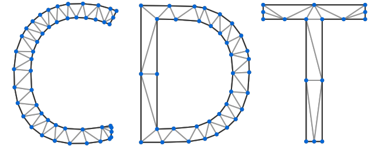
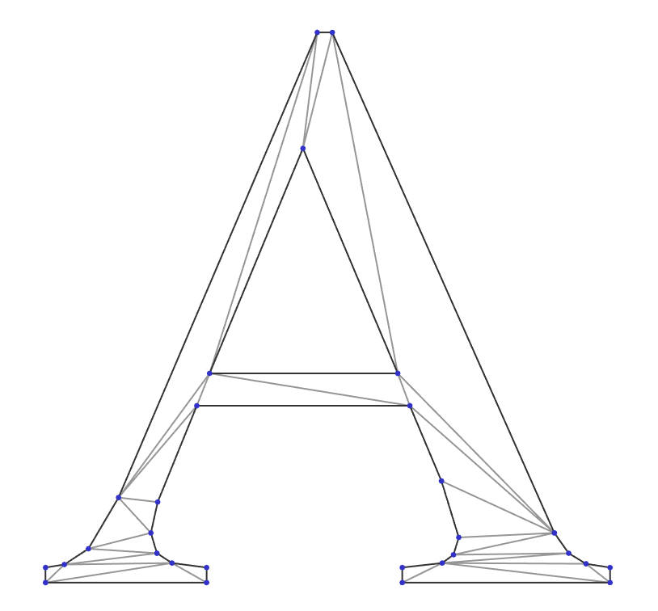
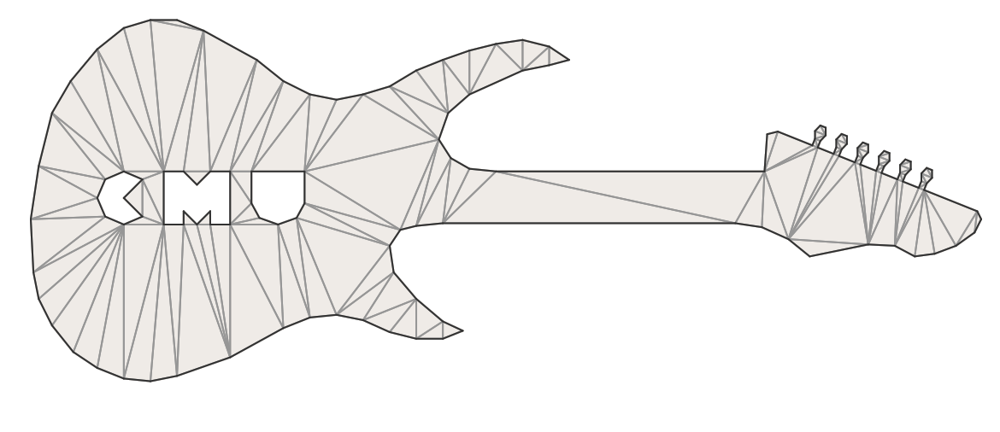
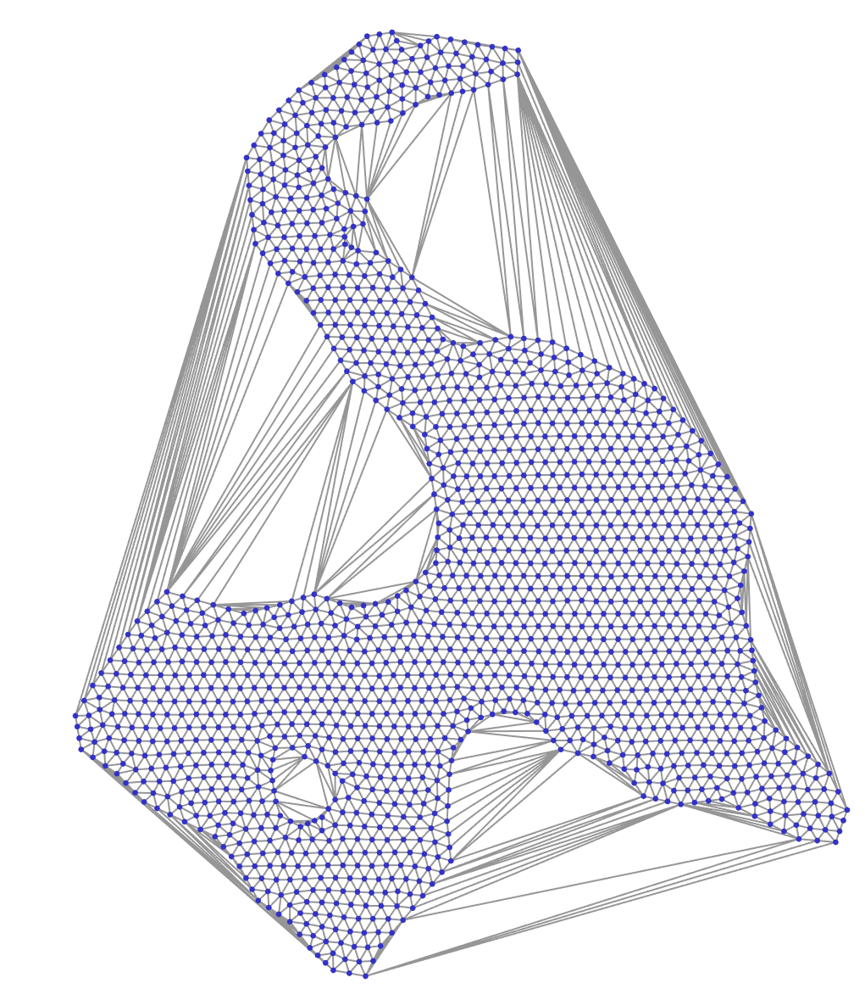
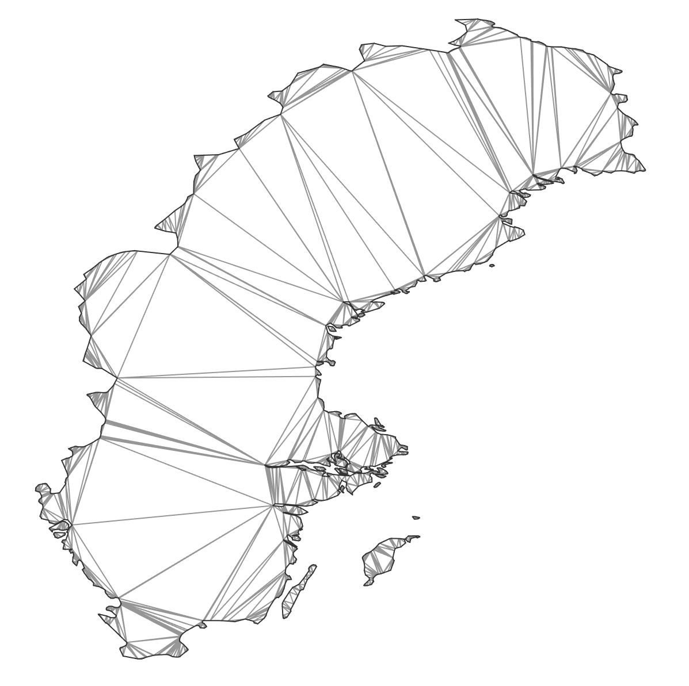

# CDT: Constrained Delaunay Triangulation

Numerically robust C++ implementation of constrained Delaunay triangulation (CDT)
- uses robust geometric predicates for numerical robustness
- can be consumed as header-only (default) or compiled (if `CDT_USE_AS_COMPILED_LIBRARY` is defined)
- permissively-licensed (MPL-2.0)
- backwards-compatible with C++03
- cross-platform: tested on Windows and Linux

### Please ★ this repository if it helped. This means a lot to the authors :)

### Table of Contents  
- [Algorithm](#algorithm)
- [Installing](#installing)
- [Details](#details)
- [Using](#using)
- [Contributors](#contributors)
- [Contributing](#contributing)
- [Examples](#examples)
- [Bibliography](#bibliography)


## Algorithm
Implementation closely follows incremental construction algorithm by Anglada [[1](#1)]. During the legalization, the cases
when at least one vertex belongs to super-triangle are resolved using an approach as described in Žalik et. al [[2](#2)].
For efficient search of a triangle that contains inserted point randomized walking search is applied [[3](#3)]. To find the starting triangle we first find the nearest point using boost::rtree or using a closest random point.

### Input pre-conditions:
- No duplicated points (use provided functions for removing duplicate points and re-mapping edges)
- No two constraint edges intersect each other

## Installing
### As header-only
No installation is needed. For the demonstrator tool qmake project file is used. It could either be opened in QtCreator directly, or qmake can be used to generate project files (e.g., makefiles or MSVC-project)
### As compiled library
Define `CDT_USE_AS_COMPILED_LIBRARY` and compile `CDT.cpp`

## Details

- Supports three ways of removing outer triangles: 
    - `eraseSuperTriangle`: produce a convex-hull  
    - `eraseOuterTriangles`: remove all outer triangles until a boundary defined by constraint edges
    - `eraseOuterTrianglesAndHoles`: remove outer triangles and automatically detected holes. Starts from super-triangle and traverses triangles until outer boundary. Triangles outside outer boundary will be removed. Then traversal continues until next boundary. Triangles between two boundaries will be kept. Traversal to next boundary continues (this time removing triangles). Stops when all triangles are traversed.

- Removing duplicate points and re-mapping constraint edges can be done using functions: `RemoveDuplicatesAndRemapEdges, RemoveDuplicates,  RemapEdges`

- Uses William C. Lenthe's implementation of robust orientation and in-circle geometric predicates: https://github.com/wlenthe/GeometricPredicates.

- Optionally depends on Boost for rtree 
implementation (finding closest point) and fall back for some std types on pre-C++11 compilers. Boost dependency can be easily be removed via defining `CDT_DONT_USE_BOOST_RTREE`. This replaces `nearestVertexRtree` with slower `nearestVertexRand`.

- A demonstrator tool is included: requires Qt for GUI. When running demo-tool **make sure** that working directory contains folder `test files`.

## Using
### Synopsis
```c++
namespace CDT
{

struct FindingClosestPoint
{
    enum Enum
    {
#ifndef CDT_DONT_USE_BOOST_RTREE
        BoostRTree,
#endif
        ClosestRandom,
    };
};

template <typename T>
class Triangulation
{
public:
    /*____ Data ____*/
    std::vector<Vertex<T> > vertices;
    std::vector<Triangle> triangles;
    EdgeUSet fixedEdges;
    /*____ API _____*/
    Triangulation(
        const FindingClosestPoint::Enum closestPtMode,
        const size_t nRandSamples = 10);
    void insertVertices(const std::vector<V2d<T> >& vertices);
    void insertEdges(const std::vector<Edge>& edges);
    void eraseSuperTriangle();
    void eraseOuterTriangles();
    void eraseOuterTrianglesAndHoles();
    // ...
}

template <typename T>
std::vector<std::size_t> RemoveDuplicates(std::vector<V2d<T> >& vertices);

void RemapEdges(
    std::vector<Edge>& edges,
    const std::vector<std::size_t>& mapping);

template <typename T>
std::vector<std::size_t> RemoveDuplicatesAndRemapEdges(
    std::vector<V2d<T> >& vertices,
    std::vector<Edge>& edges);

} // namespace CDT
```

### Triangulated convex-hull example
```c++
#include "CDT.h"
using Triangulation = CDT::Triangulation<float>;

Triangulation cdt = 
    Triangulation(CDT::FindingClosestPoint::BoostRTree);
/* 
  // Without boost::rtree:
  Triangulation(CDT::FindingClosestPoint::ClosestRandom, 10);
*/
cdt.insertVertices(/* points */);
cdt.eraseSuperTriangle();
/* ... */ = cdt.vertices;
/* ... */ = cdt.edges;
```
### Triangulated region constrained by boundary example
```c++
// ... same as above
cdt.insertVertices(/* points */);
cdt.insertEdges(/* boundary edges */);
cdt.eraseOuterTriangles();
/* ... */ = cdt.vertices;
/* ... */ = cdt.edges;
```
## Contributors
- [Artem Amirkhanov](https://github.com/artem-ogre)
- [Karl Åkerblom](https://github.com/kalleakerblom)
- [baiwenlei](https://github.com/baiwenlei): dragging and zooming in the viewer

## Contributing
Any feedback and contributions are welcome.
## License
[Mozilla Public License,  v. 2.0](https://www.mozilla.org/en-US/MPL/2.0/FAQ/)

## Examples
     


## Bibliography
<a name="1">[1]</a> Marc Vigo Anglada,
An improved incremental algorithm for constructing restricted Delaunay triangulations,
_Computers & Graphics_,
Volume 21, Issue 2,
1997,
Pages 215-223,
ISSN 0097-8493.

<a name="2">[2]</a> Borut   Žalik  and  Ivana   Kolingerová,
An incremental construction algorithm for Delaunay triangulation using the nearest-point paradigm,
_International Journal of Geographical Information Science_,
Volume 17,
Issue 2,
Pages 119-138,
2003,
DOI 10.1080/713811749.

<a name="3">[3]</a> Olivier Devillers, Sylvvain Pion, Monique Tellaud,
Walking in a triangulation,
_International Journal of Foundations of Computer Science_,
Volume 13,
Issue 2,
Pages 181-199,
2002


