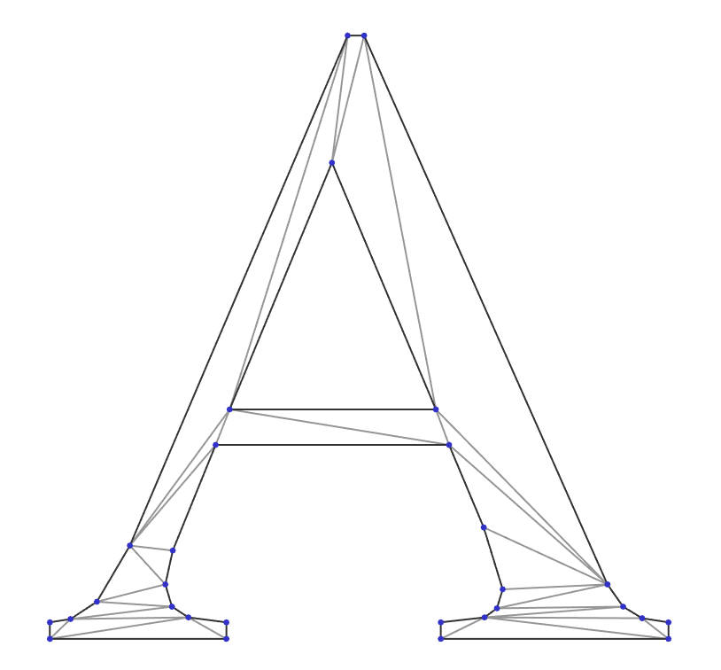

# CDT: Constrained Delaunay Triangulation

C++ implementation of constrained Delaunay triangulation (CDT)
- numerically robust (uses robust geometric predicates)
- header-only
- permissively-licensed (MPL-2.0)


## Description

- Uses William C. Lenthe's implementation of robust orientation and in-circle geometric predicates: https://github.com/wlenthe/GeometricPredicates.

- Depends on Boost for rtree implementation (finding closest point) and fall back for some std types on pre-C++11 compilers. Boost dependency can be easily be removed manually: just replace `nearestVertexRtree` with `nearestVertexRand`.

- Most of the code is c++03-compatible but robust predicates require c++11 support.

- Cross-platform: tested on Windows and Linux

A demonstrator tool is included: requires Qt for GUI.

## Algorithm
Implementation closely follows incremental construction algorithm by Anglada [[1](#1)]. During the legalization, the cases
when at least one vertex belongs to super-triangle are resolved using an approach in by Žalik et. al [[2](#2)].
For efficient search of a triangle that contains inserted point randomized walking search is applied [[3](#3)]. To find the starting triangle we first find the nearest point using boost::rtree.

### Input pre-conditions:
- No duplicated points
- No two constraint edges intersect each other

## Installing
Header-only, no installation is needed. For the demonstrator tool qmake project file is used. It could either be opened in QtCreator directly, or qmake can be used to generate project files (e.g., makefiles or MSVC-project)

## Using
### Synopsis
```c++
namespace CDT
{

template <typename T>
class Triangulation
{
public:
    /*____ Data ____*/
    std::vector<Vertex<T> > vertices;
    std::vector<Triangle> triangles;
    EdgeUSet fixedEdges;
    /*____ API _____*/
    void insertVertices(const std::vector<V2d<T> >& vertices);
    void insertEdges(const std::vector<Edge>& edges);
    void eraseSuperTriangle();
    void eraseOuterTriangles();
    // ...
}

} // namespace CDT
```

### Triangulated convex-hull example
```c++
#include "CDT.h"
using Triangulation = CDT::Triangulation<float>;

Triangulation cdt;
cdt.insertVertices(/* points */);
cdt.eraseSuperTriangle();
/* ... */ = cdt.vertices;
/* ... */ = cdt.edges;
```
### Triangulated region constrained by boundary example
```c++
// ... same as above
cdt.insertVertices(/* points */);
cdt.insertEdges(/* boundary edges */);
cdt.eraseOuterTriangles();
/* ... */ = cdt.vertices;
/* ... */ = cdt.edges;
```
## Contributors
Karl Åkerblom: algorithm implementation, triangle walking
## Contributing
Any feedback and contributions are welcome.
## License
[Mozilla Public License,  v. 2.0](https://www.mozilla.org/en-US/MPL/2.0/FAQ/)

## Examples
    


## Bibliography
<a name="1">[1]</a> Marc Vigo Anglada,
An improved incremental algorithm for constructing restricted Delaunay triangulations,
_Computers & Graphics_,
Volume 21, Issue 2,
1997,
Pages 215-223,
ISSN 0097-8493.

<a name="2">[2]</a> Borut   Žalik  and  Ivana   Kolingerová,
An incremental construction algorithm for Delaunay triangulation using the nearest-point paradigm,
_International Journal of Geographical Information Science_,
Volume 17,
Issue 2,
Pages 119-138,
2003,
DOI 10.1080/713811749.

<a name="3">[3]</a> Olivier Devillers, Sylvvain Pion, Monique Tellaud,
Walking in a triangulation,
_International Journal of Foundations of Computer Science_,
Volume 13,
Issue 2,
Pages 181-199,
2002


