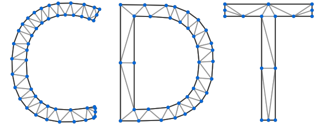
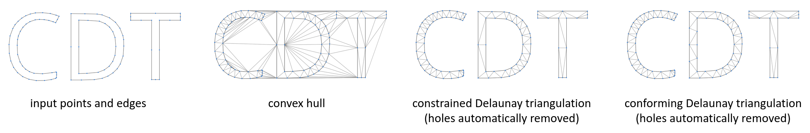
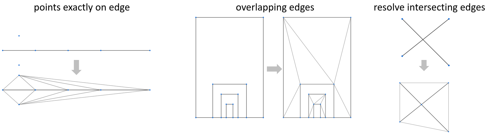
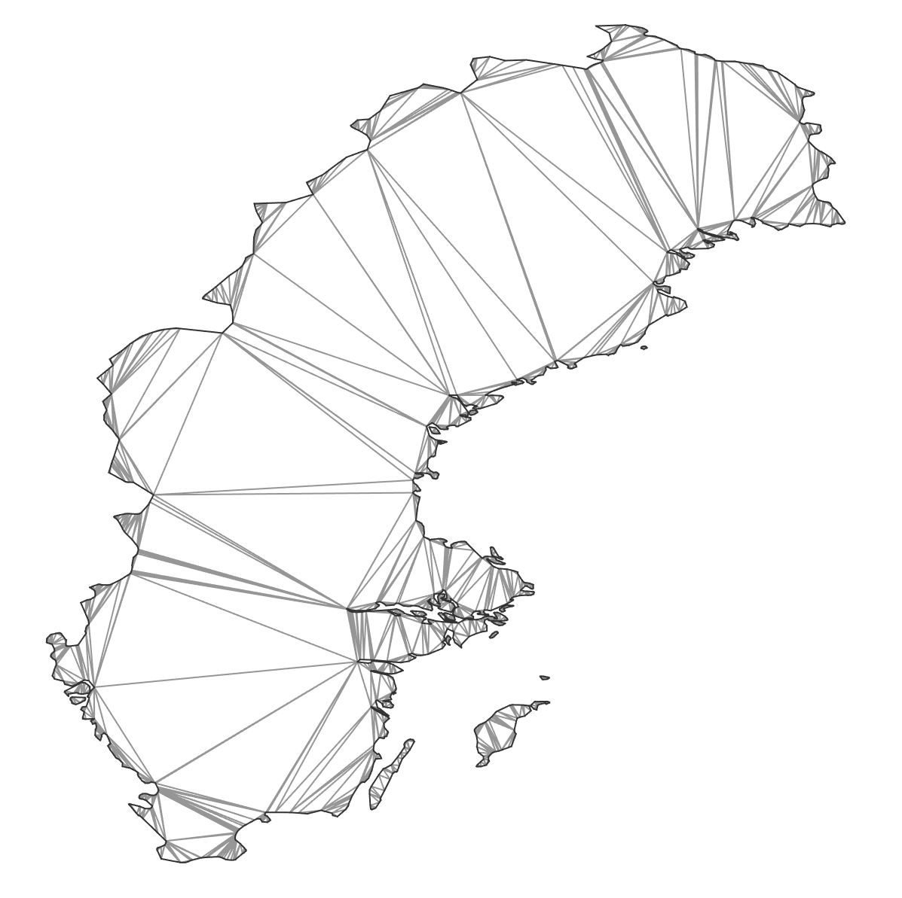

# Overview



[](https://github.com/artem-ogre/CDT/actions/)

CDT is a C++ library for generating constraint or conforming Delaunay triangulations.
- **open-source:** permissively-licensed under Mozilla Public License (MPL) 2.0
- **cross-platform:** tested on Windows, Linux (Ubuntu), and macOS
- **portable:** backwards-compatible with C++98
- **bloat-free:** no external dependencies by default
- **flexible:** can be consumed as a header-only or as a compiled library
- **performant:** continuously profiled, measured, and optimized
- **numerically robust:** triangulation algorithms rely on robust geometric predicates

***If CDT helped you please consider adding a star on [GitHub](https://github.com/artem-ogre/CDT). This means a lot to the authors*** 🤩

<a name="table-of-contents"></a>

## Table of Contents

- [Overview](#overview)
  - [Table of Contents](#table-of-contents)
  - [What can CDT do?](#what-can-cdt-do)
  - [Properly Handling the Corner-Cases](#properly-handling-the-corner-cases)
  - [Online Documentation](#online-documentation)
  - [Algorithm](#algorithm)
  - [Implementation Details](#implementation-details)
  - [Adding CDT to your C++ project Using a Package Manager](#adding-withpackage-manager)
  - [Installation/Building](#installationbuilding)
  - [Using](#using)
    - [Code Examples](#code-examples)
  - [Python bindings?](#python-bindings)
  - [Contributors](#contributors)
  - [Contributing](#contributing)
  - [License](#license)
  - [Example Gallery](#example-gallery)
  - [Bibliography](#bibliography)

<a name="what-can-cdt-do"></a>

## What can CDT do?


- Constrained Delaunay Triangulations: force edges into Delaunay triangulation
- Conforming Delaunay Triangulations: add new points into Delaunay triangulation until the edge is present in triangulation
- Convex-hulls
- Automatically finding and removing holes

<a name="properly-handling-the-corner-cases"></a>

## Properly Handling the Corner-Cases


- Points exactly on the edges
- Exactly overlapping edges
- Resolving intersecting edges by adding points at the intersections (with `CDT::IntersectingConstraintEdges::TryResolve`)


<a name="online-documentation"></a>

## Online Documentation
[**Latest online documentation**](https://artem-ogre.github.io/CDT/) (automatically generated with Doxygen).

<a name="algorithm"></a>

## Algorithm

- Implementation closely follows incremental construction algorithm by Anglada <a href="#[1]">[1]</a>.
- During the legalization, the cases
when at least one vertex belongs to super-triangle are resolved using an approach as described in Žalik et al. <a href="#[2]">[2]</a>.
- For finding a triangle that contains inserted point remembering randomized triangle walk is used <a href="#[3]">[3]</a>. To find the starting triangle for the walk the nearest point is found using a kd-tree with mid-split nodes.
- Order in which vertices are inserted is controlled by `CDT::VertexInsertionOrder`: 
  - `CDT::VertexInsertionOrder::Auto` uses breadth-first traversal of a Kd-tree for initial bulk-load <a href="#[4]">[4]</a> and randomized insertion order for the subsequent calls of `CDT::Triangulation::insertVertices`. Randomization improves performance and avoid worst-case scenarios. Generally vertex insertion with `CDT::VertexInsertionOrder::Auto` is faster.
  - The original vertices order can be optied-in using `CDT::VertexInsertionOrder::AsProvided` when constructing a triangulation. 

**Pre-conditions:**
- No duplicated points (use provided functions for removing duplicate points and re-mapping edges)
- No two constraint edges intersect each other (overlapping boundaries are allowed)

**Post-conditions:**
- Triangles have counter-clockwise (CCW) winding in a 2D coordinate system where X-axis points right and Y-axis points up.

<a name="implementation-details"></a>

## Implementation Details

- Supports three ways of removing outer triangles:
    - `CDT::Triangulation::eraseSuperTriangle`: produce a convex-hull
    - `CDT::Triangulation::eraseOuterTriangles`: remove all outer triangles until a boundary defined by constraint edges
    - `CDT::Triangulation::eraseOuterTrianglesAndHoles`: remove outer triangles and automatically detected holes. Starts from super-triangle and traverses triangles until outer boundary. Triangles outside outer boundary will be removed. Then traversal continues until next boundary. Triangles between two boundaries will be kept. Traversal to next boundary continues (this time removing triangles). Stops when all triangles are traversed.
- Supports [overlapping boundaries](#overlapping-boundaries-example)

- Removing duplicate points and re-mapping constraint edges can be done using functions: `CDT::RemoveDuplicatesAndRemapEdges`, `CDT::RemoveDuplicates`,  `CDT::RemapEdges`

- Uses William C. Lenthe's implementation of robust orientation and in-circle geometric predicates: [github.com/wlenthe/GeometricPredicates](https://github.com/wlenthe/GeometricPredicates)

- On old compilers without C++11 support Boost is used as a fall back for missing C++11 standard library features.

- A demonstrator tool is included: requires Qt for GUI. When running demo-tool **make sure** that working directory contains files from 'data' folder.


<a name="adding-withpackage-manager"></a>

## Adding CDT to your C++ project Using a Package Manager

### vcpkg
CDT port is [available](https://github.com/microsoft/vcpkg/tree/master/ports/cdt) in Microsoft's [vcpkg](https://github.com/microsoft/vcpkg).

### Conan
CDT is not in the conan-center but there's a `conanfile.py` recipe provided (in this repo).
Note that it might need small adjustments like changing boost version to fit your needs.

### spack
A [recipe](https://github.com/spack/spack/blob/develop/var/spack/repos/builtin/packages/cdt/package.py) for CDT is [available](https://spack.readthedocs.io/en/latest/package_list.html#cdt) in [spack](https://spack.io).

<a name="installationbuilding"></a>

## Installation/Building

CDT uses modern CMake and should *just work* out of the box without any surprises. The are many ways to consume CDT:
- copy headers and use as a header-only library
- add to CMake project directly with `add_subdirectory`
- pre-build and add to CMake project as a dependency with `find_package`
- consume as a Conan package

**CMake options**

| Option                      | Default value | Description                                                                                           |
| --------------------------- | :-----------: | :---------------------------------------------------------------------------------------------------- |
| CDT_USE_64_BIT_INDEX_TYPE   |      OFF      | Use 64bits to store vertex/triangle index types. Otherwise 32bits are used (up to 4.2bn items)        |
| CDT_USE_AS_COMPILED_LIBRARY |      OFF      | Instantiate templates for float and double and compiled into a library                                |

**Adding to CMake project directly**

Can be done with [`add_subdirectory`](https://cmake.org/cmake/help/latest/command/add_subdirectory.html) command (e.g., see CDT visualizer's CMakeLists.txt).
```Cmake
# add CDT as subdirectory to CMake project
add_subdirectory(../CDT CDT)
```
**Adding to non-CMake project directly**

To use as **header-only** copy headers from `CDT/include`

To use as a **compiled library** define `CDT_USE_AS_COMPILED_LIBRARY` and compile `CDT.cpp`

**Consume pre-build CDT in CMake project with [find_package](https://cmake.org/cmake/help/latest/command/find_package.html)**

CDT provides package config files that can be included by other projects to find and use it.

```bash
# from CDT folder
mkdir build && cd build
# configure with desired CMake flags
cmake -DCDT_USE_AS_COMPILED_LIBRARY=ON ..
# build and install
cmake --build . && cmake --install .
```

```CMake
# In consuming CMakeLists.txt
find_package(CDT REQUIRED CONFIG)
```

<a name="using"></a>

## Using

Public API is provided in two places:
- `CDT::Triangulation` class is used for performing constrained Delaunay triangulations.
- Free functions in `CDT.h` provide some additional functionality for removing duplicates, re-mapping edges and triangle depth-peeling


<a name="code-examples"></a>

### Code Examples

**Delaunay triangulation without constraints (triangulated convex-hull)**


```cpp
#include "CDT.h"
CDT::Triangulation<double> cdt;
cdt.insertVertices(/* points */);
cdt.eraseSuperTriangle();
/* access triangles */ = cdt.triangles;
/* access vertices */ = cdt.vertices;
/* access boundary (fixed) edges */ = cdt.fixedEdges;
/* calculate all edges (on demand) */ = CDT::extractEdgesFromTriangles(cdt.triangles);
```

**Constrained Delaunay triangulation (auto-detected boundaries and holes)**


```cpp
// ... same as above
cdt.insertVertices(/* points */);
cdt.insertEdges(/* boundary edges */);
cdt.eraseOuterTrianglesAndHoles();
/* access triangles */ = cdt.triangles;
/* access vertices */ = cdt.vertices;
/* access boundary (fixed) edges */ = cdt.fixedEdges;
/* calculate all edges (on demand) */ = CDT::extractEdgesFromTriangles(cdt.triangles);
```

**Conforming Delaunay triangulation**

Use `CDT::Triangulation::conformToEdges` instead of `CDT::Triangulation::insertEdges`

**Resolve edge intersections by adding new points and splitting edges**

Pass `CDT::IntersectingConstraintEdges::TryResolve` to `CDT::Triangulation` constructor.

**Custom point/edge type**

```cpp
struct CustomPoint2D
{
    double data[2];
};

struct CustomEdge
{
    std::pair<std::size_t, std::size_t> vertices;
};

// containers other than std::vector will work too
std::vector<CustomPoint2D> points = /*...*/; 
std::vector<CustomEdge> edges = /*...*/;
CDT::Triangulation<double> cdt;
cdt.insertVertices(
    points.begin(),
    points.end(),
    [](const CustomPoint2D& p){ return p.data[0]; },
    [](const CustomPoint2D& p){ return p.data[1]; }
);
cdt.insertEdges(
    edges.begin(),
    edges.end(),
    [](const CustomEdge& e){ return e.vertices.first; },
    [](const CustomEdge& e){ return e.vertices.second; }
);
```

<a name="python-bindings"></a>

## Python bindings?
For work-in-progress on Python bindings check-out [PythonCDT](https://github.com/artem-ogre/PythonCDT)

<a name="contributors"></a>

## Contributors
- [Artem Amirkhanov](https://github.com/artem-ogre)
- [Karl Åkerblom](https://github.com/kalleakerblom)
- [baiwenlei](https://github.com/baiwenlei): dragging and zooming in the viewer
- [Bärbel Holm](https://github.com/eisbaerli): removing duplicates and re-mapping edges
- [Andre Fecteau](https://github.com/AndreFecteau): benchmarking, profiling, and providing a kd-tree implementation a derivative of which is included in CDT
- [msokalski](https://github.com/msokalski): algorithm discussions and suggestions, bug finding
- [alkonior](https://github.com/alkonior): finding, reproducing, and reporting a bug ([#142](https://github.com/artem-ogre/CDT/issues/142))
- [ldcMasa](https://github.com/ldcMasa): finding compilation issue ([#144](https://github.com/artem-ogre/CDT/issues/144))
- [egladil86](https://github.com/egladil86): finding, reproducing, and reporting a bug ([#148](https://github.com/artem-ogre/CDT/issues/148))
- [Som1Lse](https://github.com/Som1Lse): fuzzing CDT: finding, reproducing, and reporting bugs ([#154](https://github.com/artem-ogre/CDT/issues/148))

<a name="contributing"></a>

## Contributing
Any feedback and contributions are welcome.

<a name="license"></a>

## License

[Mozilla Public License,  v. 2.0](https://www.mozilla.org/en-US/MPL/2.0/FAQ/)

For attribution you can use the following template:
```
This software is based part on CDT (C++ library for constrained Delaunay triangulation):
Copyright © 2019 Leica Geosystems Technology AB
Copyright © The CDT Contributors
Licensed under the MPL-2.0 license.
https://github.com/artem-ogre/CDT
${INSERT_FULL_MPL_2.0_TEXT}
```

<a name="example-gallery"></a>

## Example Gallery
      <a name="overlapping-boundaries-example"/></a> 

<a name="bibliography"></a>

## Bibliography
<a name="[1]">[1]</a> Marc Vigo Anglada,
An improved incremental algorithm for constructing restricted Delaunay triangulations,
_Computers & Graphics_,
Volume 21, Issue 2,
1997,
Pages 215-223,
ISSN 0097-8493.

<a name="[2]">[2]</a> Borut   Žalik  and  Ivana   Kolingerová,
An incremental construction algorithm for Delaunay triangulation using the nearest-point paradigm,
_International Journal of Geographical Information Science_,
Volume 17,
Issue 2,
Pages 119-138,
2003,
DOI 10.1080/713811749.

<a name="[3]">[3]</a> Olivier Devillers, Sylvvain Pion, Monique Tellaud,
Walking in a triangulation,
_International Journal of Foundations of Computer Science_,
Volume 13,
Issue 2,
Pages 181-199,
2002

<a name="[4]">[4]</a> Liu, Jianfei & Yan, Jinhui & Lo, S..
A new insertion sequence for incremental Delaunay triangulation.
_Acta Mechanica Sinica_,
Volume 29,
2013
