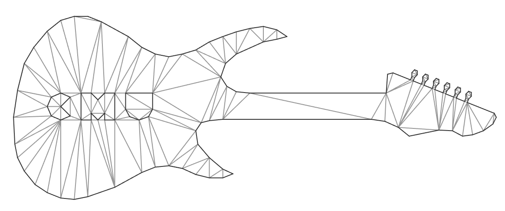
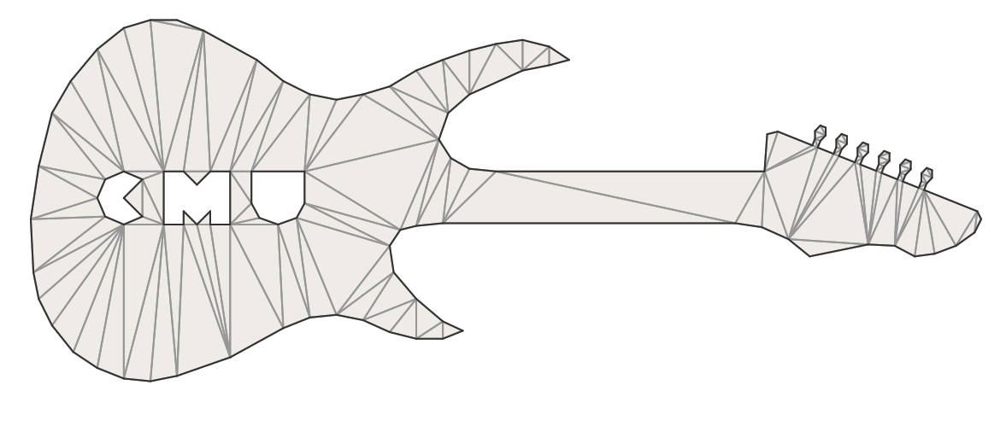

# CDT: Constrained Delaunay Triangulation

[](https://github.com/artem-ogre/CDT/actions/)

Numerically robust C++ implementation of constrained Delaunay triangulation (CDT)
- uses robust geometric predicates for numerical robustness
- can be consumed as header-only (default) or compiled (if `CDT_USE_AS_COMPILED_LIBRARY` is defined)
- permissively-licensed (MPL-2.0)
- backwards-compatible with C++03
- cross-platform: tested on Windows, Linux (Ubuntu), and macOS

**Please ★ this repository if it helped. This means a lot to the authors :)**

**Table of Contents**
- [Online Documentation](#online-doc)
- [Algorithm](#algorithm)
- [Installation](#installation)
- [Details](#details)
- [Using](#using)
- [Contributors](#contributors)
- [Contributing](#contributing)
- [Examples](#examples)
- [Bibliography](#bibliography)

## <a name="online-doc"/>Online Documentation</a>
[**Latest online documentation**](https://artem-ogre.github.io/CDT/doxygen/index.html) (automatically generated with Doxygen).

## <a name="algorithm"/>Algorithm</a>

Implementation closely follows incremental construction algorithm by Anglada [[1](#1)]. During the legalization, the cases
when at least one vertex belongs to super-triangle are resolved using an approach as described in Žalik et. al [[2](#2)].
For efficient search of a triangle that contains inserted point randomized walking search is applied [[3](#3)]. To find the starting triangle we first find the nearest point using boost::rtree or using a closest random point.

**Pre-conditions:**
- No duplicated points (use provided functions for removing duplicate points and re-mapping edges)
- No two constraint edges intersect each other

**Post-conditions:**
- Triangles have counter-clockwise (CCW) winding

## <a name="installation"/>Installation</a>
**Adding to CMake project directly**

Can be done with [`add_subdirectory`](https://cmake.org/cmake/help/latest/command/add_subdirectory.html) command (e.g., see CDT visualizer's CMakeLists.txt).
```Cmake
# add CDT as subdirectory to CMake project
add_subdirectory(../CDT CDT)
```
**Adding to non-CMake project directly**

To use as **header-only** copy headers from `CDT/include`

To use as a **compiled library** define `CDT_USE_AS_COMPILED_LIBRARY` and compile `CDT.cpp`

**Consume pre-build CDT in CMake project with [`find_package`](https://cmake.org/cmake/help/latest/command/find_package.html)**

CDT provides package config files that can be included by other projects to find and use it.

```bash
# from CDT folder
mkdir build && cd build
# configure with desired CMake flags
cmake -DCDT_USE_AS_COMPILED_LIBRARY=ON -DCDT_USE_BOOST=ON ..
# build and install
cmake --build . && cmake --install .
```

```CMake
# In consuming CMakeLists.txt
find_package(CDT REQUIRED CONFIG)
```

**Consume as [Conan](https://conan.io/) package**

There's a `conanfile.py` recipe provided.
Note that it might need small adjustments like changing boost version to fit your needs.

## <a name="details"/>Details</a>

- Supports three ways of removing outer triangles:
    - `eraseSuperTriangle`: produce a convex-hull
    - `eraseOuterTriangles`: remove all outer triangles until a boundary defined by constraint edges
    - `eraseOuterTrianglesAndHoles`: remove outer triangles and automatically detected holes. Starts from super-triangle and traverses triangles until outer boundary. Triangles outside outer boundary will be removed. Then traversal continues until next boundary. Triangles between two boundaries will be kept. Traversal to next boundary continues (this time removing triangles). Stops when all triangles are traversed.

- Removing duplicate points and re-mapping constraint edges can be done using functions: `RemoveDuplicatesAndRemapEdges, RemoveDuplicates,  RemapEdges`

- Uses William C. Lenthe's implementation of robust orientation and in-circle geometric predicates: https://github.com/wlenthe/GeometricPredicates.

- Boost is an optional dependency used for:
    * **Performance:** rtree implementation for finding the closest point during points insertion:  `nearestVertexRtree` is a faster than `nearestVertexRand`. Also `boost::container::flat_set` is used for faster triangle walking
    * **Fall back** for standard library features missing in C++98 compilers.

    To opt in define `CDT_USE_BOOST` either in CMake or in a preprocessor.

- A demonstrator tool is included: requires Qt for GUI. When running demo-tool **make sure** that working directory contains folder `test files`.

## <a name="using"/>Using</a>

**Synopsis of the public API (see CDT.h )**

```c++
namespace CDT
{

/// Enum of strategies for finding closest point to the newly inserted one
struct FindingClosestPoint
{
    enum Enum
    {
#ifdef CDT_USE_BOOST
        BoostRTree, ///< use boost::geometry::rtree
#endif
        ClosestRandom, ///< pick closest from few randomly selected candidates
    };
};

template <typename T>
class CDT_EXPORT Triangulation
{
public:
    typedef std::vector<Vertex<T> > VertexVec; ///< Vertices vector
    VertexVec vertices;                        ///< triangulation's vertices
    TriangleVec triangles;                     ///< triangulation's triangles
    EdgeUSet fixedEdges; ///<  triangulation's constraints (fixed edges)

    /*____ API _____*/
    Triangulation(
        const FindingClosestPoint::Enum closestPtMode,
        const size_t nRandSamples = 10);
    template <typename TVertexIter, typename TGetVertexCoordX, typename TGetVertexCoordY>
    void insertVertices(
        TVertexIter first,
        TVertexIter last,
        TGetVertexCoordX getX,
        TGetVertexCoordY getY);
    void insertVertices(const std::vector<V2d<T> >& vertices);
    template <typename TEdgeIter, typename TGetEdgeVertexStart, typename TGetEdgeVertexEnd>
    void insertEdges(
        TEdgeIter first,
        TEdgeIter last,
        TGetEdgeVertexStart getStart,
        TGetEdgeVertexEnd getEnd);
    void insertEdges(const std::vector<Edge>& edges);
    void eraseSuperTriangle();
    void eraseOuterTriangles();
    void eraseOuterTrianglesAndHoles();
};

struct DuplicatesInfo
{
    std::vector<std::size_t> mapping;    ///< vertex index mapping
    std::vector<std::size_t> duplicates; ///< duplicates' indices
};

template <typename T, typename TVertexIter, typename TGetVertexCoordX, typename TGetVertexCoordY>
DuplicatesInfo FindDuplicates(
    TVertexIter first,
    TVertexIter last,
    TGetVertexCoordX getX,
    TGetVertexCoordY getY);

template <typename TVertex, typename TAllocator>
void RemoveDuplicates(
    std::vector<TVertex, TAllocator>& vertices,
    const std::vector<std::size_t>& duplicates);

template <typename T>
DuplicatesInfo RemoveDuplicates(std::vector<V2d<T> >& vertices);

void RemapEdges(std::vector<Edge>& edges, const std::vector<std::size_t>& mapping);

template <
    typename T,
    typename TVertex,
    typename TGetVertexCoordX,
    typename TGetVertexCoordY,
    typename TVertexAllocator,
    typename TEdgeAllocator>
DuplicatesInfo RemoveDuplicatesAndRemapEdges(
    std::vector<TVertex, TVertexAllocator>& vertices,
    std::vector<Edge, TEdgeAllocator>& edges,
    TGetVertexCoordX getX,
    TGetVertexCoordY getY);

template <typename T>
DuplicatesInfo RemoveDuplicatesAndRemapEdges(
    std::vector<V2d<T> >& vertices,
    std::vector<Edge>& edges);

template <typename T>
std::vector<unsigned short> CalculateTriangleDepths(
    const std::vector<Vertex<T> >& vertices,
    const TriangleVec& triangles,
    const EdgeUSet& fixedEdges);

TriIndUSet PeelLayer(
    std::stack<TriInd> seeds,
    const TriangleVec& triangles,
    const EdgeUSet& fixedEdges,
    const unsigned short layerDepth,
    std::vector<unsigned short>& triDepths);

} // namespace CDT
```

**Triangulated convex-hull example**

```c++
#include "CDT.h"
using Triangulation = CDT::Triangulation<float>;

Triangulation cdt =
    Triangulation(CDT::FindingClosestPoint::BoostRTree);
/*
  // Without boost::rtree:
  Triangulation(CDT::FindingClosestPoint::ClosestRandom, 10);
*/
cdt.insertVertices(/* points */);
cdt.eraseSuperTriangle();
/* ... */ = cdt.vertices;
/* ... */ = cdt.edges;
```
**Triangulated region constrained by boundary example**

```c++
// ... same as above
cdt.insertVertices(/* points */);
cdt.insertEdges(/* boundary edges */);
cdt.eraseOuterTriangles();
/* ... */ = cdt.vertices;
/* ... */ = cdt.edges;
```

**Custom point type**

```c++
struct CustomPoint2D
{
    double data[2];
};

std::vector<CustomPoint2D> points = ...; // containers other than std::vector will work too
triangulation = CDT::Triangulation<double>(...);
triangulation.insertVertices(
    points.begin(),
    points.end(),
    [](const CustomPoint2D& p){ return p.data[0]; },
    [](const CustomPoint2D& p){ return p.data[1]; }
);
```

**Custom edge type**
```c++
struct CustomEdge
{
    std::pair<std::size_t, std::size_t> vertices;
};

std::vector<CustomEdge> edges = ...; // containers other than std::vector will work too
triangulation = CDT::Triangulation<double>(...);
triangulation.insertVertices(...);
triangulation.insertEdges(
    edges.begin(),
    edges.end(),
    [](const CustomEdge& e){ return e.vertices.first; },
    [](const CustomEdge& e){ return e.vertices.second; }
);
```
## <a name="contributors"/>Contributors</a>
- [Artem Amirkhanov](https://github.com/artem-ogre)
- [Karl Åkerblom](https://github.com/kalleakerblom)
- [baiwenlei](https://github.com/baiwenlei): dragging and zooming in the viewer

## <a name="contributing"/>Contributing</a>
Any feedback and contributions are welcome.

## <a name="license"/>License</a>

[Mozilla Public License,  v. 2.0](https://www.mozilla.org/en-US/MPL/2.0/FAQ/)

## <a name="examples"/>Examples</a>
     

## <a name="bibliography"/>Bibliography</a>
<a name="1">[1]</a> Marc Vigo Anglada,
An improved incremental algorithm for constructing restricted Delaunay triangulations,
_Computers & Graphics_,
Volume 21, Issue 2,
1997,
Pages 215-223,
ISSN 0097-8493.

<a name="2">[2]</a> Borut   Žalik  and  Ivana   Kolingerová,
An incremental construction algorithm for Delaunay triangulation using the nearest-point paradigm,
_International Journal of Geographical Information Science_,
Volume 17,
Issue 2,
Pages 119-138,
2003,
DOI 10.1080/713811749.

<a name="3">[3]</a> Olivier Devillers, Sylvvain Pion, Monique Tellaud,
Walking in a triangulation,
_International Journal of Foundations of Computer Science_,
Volume 13,
Issue 2,
Pages 181-199,
2002


